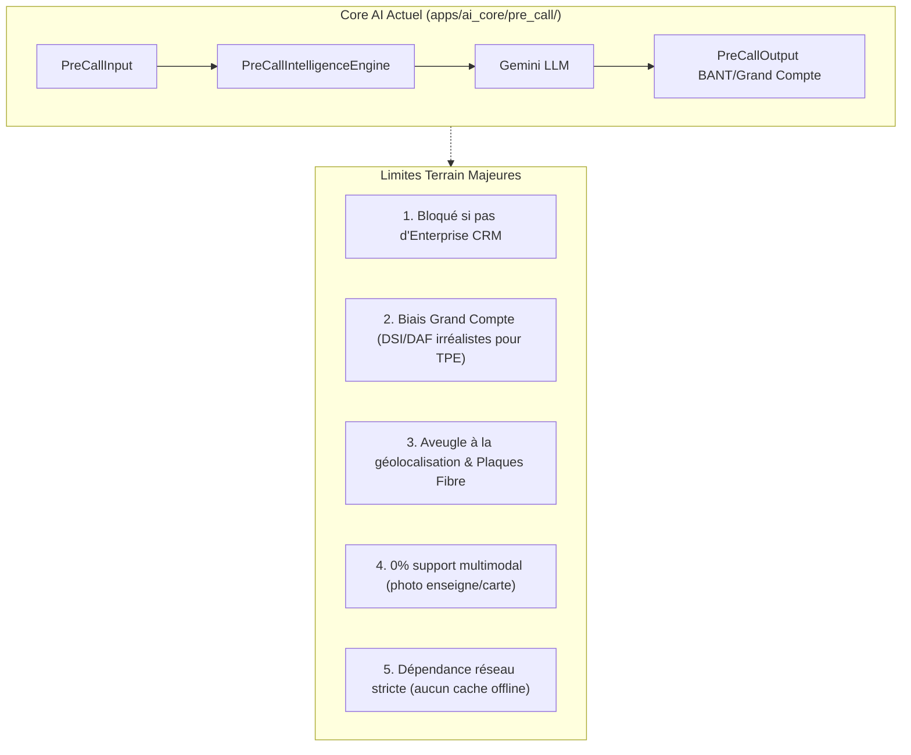
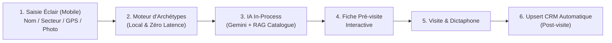
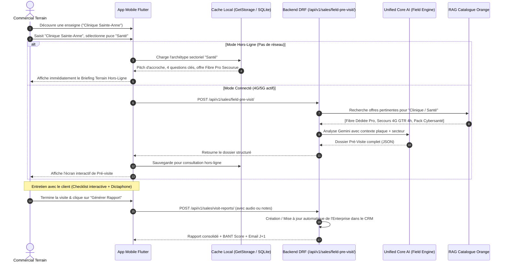

# Architecture & Stratégie d'Implémentation : Pré-visite Commerciale Terrain (Onbora)

Ce document analyse en profondeur l'implémentation de la fonctionnalité de **pré-visite commerciale terrain**, diagnostique les capacités et les limites actuelles du **Core AI**, et définit la stratégie d'ingénierie pour traiter les cas critiques où les données clients **ne proviennent pas du CRM** (prospection sauvage, porte-à-porte, création à la volée sur le terrain).

---

## 1. Contexte Métier & Enjeux de la Pré-visite Terrain

### 1.1 Le Défi du Commercial B2B sur le Terrain
Dans la vente de services managés (MSP / Orange Business), le commercial terrain a deux modes d'action distincts :
1. **Le Rendez-vous Planifié (Portefeuille CRM)** : L'entreprise est répertoriée, qualifiée, avec un historique, un contact identifié (DSI, DG, DAF) et des métriques connues.
2. **La Prospection Sauvage / Porte-à-Porte (Hors-CRM)** : Le commercial marche dans une avenue commerciale, une zone industrielle ou un quartier d'affaires. Il repère une clinique privée, une étude notariale, une école, un supermarché ou un entrepôt. **L'entreprise n'existe pas dans la base de données**.

### 1.2 L'Objectif de la Fonctionnalité Pré-visite
Avant de pousser la porte ou d'aborder le responsable, le commercial dispose de **30 à 60 secondes** pour :
- Avoir un **pitch d'accroche (Icebreaker)** pertinent pour le secteur d'activité.
- Connaître les **douleurs télécoms et IT typiques** de ce type d'établissement.
- Poser les **3 à 4 questions de découverte percutantes** qui font verbaliser un manque à gagner ou un risque d'arrêt d'activité.
- Savoir quelle **offre Orange Business** positionner (Fibre Pro, Secours 4G, Hotspot sécurisé, Téléphonie Cloud, Cybersécurité).
- Savoir si l'adresse est **couverte par une plaque fibre Onbora / Orange**.

---

## 2. Diagnostic du Core AI Actuel & Limites Identifiées

### 2.1 Ce que le Core AI Couvre Déjà (`PreCallIntelligenceEngine`)
Le composant `backend/apps/ai_core/pre_call/` implémente :
- **`PreCallInput`** : Attend `company_name`, `sector`, `locations_count`, `website_url`, `annual_revenue`, `current_operator`, `current_connectivity`, `known_context`.
- **`PreCallIntelligenceEngine`** : Fait appel à Gemini via `call_gemini_json` avec un system prompt orienté grand compte/PME pour produire :
  - `company_overview` (synthèse, effectif estimé, maturité digitale) ;
  - `key_decision_makers` (rôles, profils psycho-commerciaux, douleurs) ;
  - `detected_business_challenges` (risques de rupture d'activité, interconnexion de sites) ;
  - `custom_pitch_angles` (offres Orange du catalogue filtrées par RAG TF-IDF, justification, question d'accroche) ;
  - `critical_discovery_questions` & `golden_rules`.
- **Fallback local heuristique** : En cas de coupure de l'API Gemini, renvoie un profil de repli structuré.

### 2.2 Ce que le Core AI Ne Couvre Pas Actuellement (Les Gaps)



1. **Dépendance stricte au CRM** :
   Dans `backend/apps/sales/application/use_cases.py` (`CreateVisitPreparationUseCase`), le système fait `Enterprise.objects.get(pk=enterprise_id)` et recopie des champs statiques déjà pré-générés (`ai_hypotheses`, `ai_tailored_pitch`). Si le prospect n'est pas dans le CRM, l'API échoue avec une erreur HTTP 404 / 400.
2. **Biais de taille d'entreprise (Grand Compte vs TPE/PME de quartier)** :
   Le prompt existant présume systématiquement un "DSI" et un "DAF". Pour un cabinet médical de 4 personnes ou une pharmacie, l'interlocuteur est le gérant, le médecin titulaire ou le responsable de boutique.
3. **Absence de contexte physique & réseau local** :
   Le Core AI ignore si le bâtiment se trouve sous une plaque fibre déjà fibrée par Orange ou en zone blanche DSL/hertzien.
4. **Absence d'entrée multimodale** :
   Le commercial ne peut pas simplement photographier l'enseigne, la vitrine ou la carte de visite pour que l'IA en déduise l'activité et le nom.
5. **Absence de résilience Offline** :
   Si le commercial est en sous-sol, dans un entrepôt isolé ou en zone à faible débit, l'appel API échoue et le commercial se retrouve sans fiche de préparation.

---

## 3. Stratégie d'Ingénierie pour les Données Hors-CRM

Lorsque le commercial prospecte à froid, les données clients n'existent pas dans le CRM. Voici la stratégie en 4 niveaux mise en place pour lever ce verrou :



### 3.1 Niveau 1 : Capture Éclair Zéro-Friction (Mobile Intake)
Sur le terrain, il est interdit de contraindre le commercial à remplir un formulaire de 15 champs. La capture prend **moins de 5 secondes** via 3 canaux au choix :
- **Mode Puces Express** : 
  - Champ texte libre pour le Nom (ex : *"Cabinet Médical Saint-Luc"*).
  - Puces sectorielles directes : `Santé / Clinique`, `Cabinet Juridique`, `Commerce / Retail`, `Éducation`, `Hôtellerie / Resto`, `BTP / Industrie`, `Services B2B`.
  - Estimation de taille en 1 clic : `1-5 pers.`, `6-20 pers.`, `21-50 pers.`, `50+ pers.`.
- **Mode Photo Multimodale (Vision OCR)** :
  - Le commercial prend en photo la façade, le panneau d'enseigne ou la carte de visite.
  - Le Core AI (Gemini 2.5 Flash Multimodal) extrait automatiquement le nom, le secteur et le téléphone.
- **Mode Géolocalisation / Plaque** :
  - Le GPS détecte automatiquement la commune, le quartier et la plaque technique Orange active.

### 3.2 Niveau 2 : Registre d'Archétypes Sectoriels (Cold Start Heuristics)
Pour garantir une réponse immédiate (< 50ms) et fonctionner **même hors-ligne**, Onbora dispose d'un catalogue d'archétypes sectoriels pré-compilés :

| Secteur Cible | Enjeux Métier Critiques | Équipements Clés | Concurrents Typiques | Offre Orange Cible | Question d'Accroche ("Icebreaker") |
| :--- | :--- | :--- | :--- | :--- | :--- |
| **Santé & Clinique** | Télétransmission d'actes, transferts radios/IRM, continuité du dossier patient. | Terminaux CB, PC consultations, serveurs locaux. | Ligne ADSL instable, box grand public. | **Fibre Dédiée Pro + Secours 4G automatique** | *"Que se passe-t-il pour vos admissions et télétransmissions si votre box coupe pendant 2 heures ?"* |
| **Pharmacie & Commerce** | Caisse enregistreuse connectée, TPE bancaire, inventaire en temps réel. | TPE, caisses tactiles, caméras IP. | Clé 4G précaire, modem basique. | **Pack Connectivité Boutique Pro (GTR 4h)** | *"Combien de transactions CB perdez-vous en moyenne lors des ralentissements de fin de mois ?"* |
| **Cabinet Avocat / Notaire** | Confidentialité, archivage sécurisé, signature électronique d'actes. | Serveur de messagerie, VPN, coffre-fort numérique. | Opérateur grand public sans chiffrement. | **CyberSOC PME + Fibre Pro Sécurisée (IP Fixe)** | *"Comment garantissez-vous la conformité de vos échanges d'actes confidentiels face aux cyber-risques ?"* |
| **Éducation & Écoles** | Portails de notes, Wifi sécurisé pour élèves séparé du réseau pédagogique. | Salle informatique, portail cloud, wifi. | Ligne mutualisée saturée en heures de pointe. | **Fibre Campus Pro + Filtrage Web & Borne Wifi Pro** | *"Vos enseignants se plaignent-ils de lenteurs quand les élèves se connectent au réseau ?"* |
| **Hôtel & Restauration** | Portail captif client, gestion des réservations (Booking/PMS), téléphonie. | PMS cloud, téléphones chambres, Wifi public. | Multiples box grand public non managées. | **Orange Hotspot Pro Managé + Trunk SIP** | *"Votre Wifi clients est-il strictement isolé de votre logiciel de facturation et de vos TPE ?"* |

### 3.3 Niveau 3 : Inférence Core AI Hybride (Enrichissement Dynamique)
Si une connexion internet est disponible :
1. Le backend reçoit les données minimales saisies.
2. Il interroge le RAG Catalogue Orange Business avec le vecteur sectoriel.
3. Gemini génère le dossier d'attaque sur-mesure adapté à la taille spécifiée (TPE vs PME vs ETI).
4. Le dossier est retourné en JSON structuré et mis en cache localement dans l'application mobile.

### 3.4 Niveau 4 : Création & Provisioning Post-Visite dans le CRM (Pas d'effort préalable)
- Pendant la pré-visite, aucune contrainte d'intégrité CRM n'est imposée : le système crée une entité transitoire `FieldProspectSession` ou un `Enterprise` avec le flag `source='FIELD_DISCOVERY'` et `status='PROSPECT_A_QUALIFIER'`.
- Pendant la visite, le commercial active le dictaphone ou coche la checklist de pré-visite.
- Après la visite, le moteur `GenerateVisitReportWithAIUseCase` produit le rapport complet, met à jour le nom du gérant collecté lors de l'échange, les coordonnées et les besoins réels, et convertit automatiquement le prospect en compte CRM complet avec son BANT Score !

---

## 4. Architecture Technique Cible (Clean Architecture)

### 4.1 Vue d'Ensemble des Composants

```
backend/
├── apps/
│   ├── ai_core/
│   │   ├── field_intelligence/            <-- NOUVEAU MODULE TERRAIN
│   │   │   ├── archetypes.py              <-- Matrice des archétypes sectoriels
│   │   │   ├── service.py                 <-- FieldPreVisitEngine
│   │   │   └── vision_parser.py           <-- Extraction multimodale (façade/carte)
│   │   └── pre_call/
│   │       ├── models.py                  <-- Schémas Pydantic étendus
│   │       └── service.py                 <-- PreCallIntelligenceEngine
│   └── sales/
│       ├── models.py                      <-- FieldVisitSession & Enterprise extension
│       ├── api/
│       │   └── field_previsit_views.py    <-- Endpoints DRF pour la pré-visite terrain
│       └── application/
│           └── use_cases.py               <-- GenerateFieldPreVisitUseCase
```

### 4.2 Diagramme de Séquence Complet (Mobile <-> Backend <-> Core AI)



---

## 5. Contrats d'API & Schémas JSON

### 5.1 Endpoint d'Ingestion Pré-visite Terrain
- **URL** : `/api/v1/sales/field-pre-visit/`
- **Méthode** : `POST`
- **Permissions** : `IsSalespersonOrAdmin`

#### Requête (Payload Entrant) :
```json
{
  "enterprise_id": null,
  "company_name": "Cabinet Dentaire Dr. Ilunga",
  "sector": "SANTE",
  "approximate_size": "2-5_EMPLOYEES",
  "latitude": -4.32145,
  "longitude": 15.31289,
  "observed_equipment": ["TPE_BANCAIRE", "PC_FIXES", "BOX_INTERNET_INCONNUE"],
  "image_base64": null
}
```

#### Réponse (Payload Sortant) :
```json
{
  "session_id": "fpv_98412a8f",
  "enterprise_id": 142,
  "company_name": "Cabinet Dentaire Dr. Ilunga",
  "sector_label": "Santé & Soins Médicaux",
  "plaque_coverage": {
    "is_covered": true,
    "plaque_name": "Gombe-Centre-Zone-4",
    "technology": "FTTH_ET_FTTO",
    "delivery_sla": "GTR 4h"
  },
  "executive_briefing": {
    "estimated_revenue_risk_hourly": "150 $ / heure d'arrêt",
    "primary_decision_maker": "Médecin Titulaire / Gérant du Cabinet",
    "digital_maturity": "MEDIUM"
  },
  "recommended_opening_pitch": "Docteur, nous équipons plusieurs cabinets du quartier en fibre dédiée sécurisée : si votre télétransmission ou vos TPE coupent en pleine consultation, quel est votre plan de secours immédiat ?",
  "discovery_checklist": [
    {
      "id": "q1",
      "question": "Quel est votre opérateur internet actuel et avez-vous déjà subi des coupures de télétransmission ?",
      "category": "PAIN_POINT",
      "checked": false
    },
    {
      "id": "q2",
      "question": "Avez-vous une seconde ligne qui prend le relais automatiquement en cas de panne ?",
      "category": "RESILIENCE",
      "checked": false
    },
    {
      "id": "q3",
      "question": "Combien de postes et de lecteurs de cartes fonctionnent simultanément ?",
      "category": "VOLUME",
      "checked": false
    }
  ],
  "target_catalog_offers": [
    {
      "code": "FIBRE_PRO_SEC_4H",
      "title": "Fibre Sécurisée Dédiée Pro 50 Mbps (GTR 4h)",
      "monthly_price": "250 $/mois",
      "killer_argument": "Garantie de rétablissement en 4 heures avec bascule 4G automatique sans interruption."
    },
    {
      "code": "TPE_SEC_ORANGE",
      "title": "Secours 4G Multi-Opérateur pour TPE & Caisse",
      "monthly_price": "45 $/mois",
      "killer_argument": "Sécurise vos encaissements par carte même en cas de coupure générale de courant ou de fibre."
    }
  ],
  "pitfalls_to_avoid": [
    "Ne pas parler de termes ultra-techniques (VLAN, BGP, peering) au médecin.",
    "Se concentrer sur le confort des patients et l'absence totale de perte d'honoraires."
  ],
  "offline_cached": true
}
```

---

## 6. Spécifications UX / UI Mobile (Conforme à `DESIGN.md`)

Pour respecter strictement la charte Onbora (`DESIGN.md`) et les règles anti-dette :
1. **Zéro Émoji Unicode** : Toutes les icônes utilisent le pack vectoriel Cupertino (`CupertinoIcons.waveform`, `CupertinoIcons.checkmark_seal`, `CupertinoIcons.location_solid`, `CupertinoIcons.shield_lefthalf_fill`).
2. **Règle chromatique 60-30-10** :
   - Fond Dark : `#242124` / Fond Light : `#F6F5F2`.
   - Cartes : `#2F2C30` / `#FFFFFF`.
   - Bouton d'action principal (10% Accent) : Bleu Cobalt `#4F6CE8`.
3. **Parcours Écran de Pré-visite (`visit_preparation_screen.dart`)** :
   - **Header Card** : Nom du prospect + Badge de couverture Plaque Fibre (Vert émeraude `#10B981` ou Orange Ambre `#F59E0B`).
   - **Card "Accroche Commerciale (Icebreaker)"** : Texte en grand format 16px avec bouton "Copier / Écouter" pour mémorisation rapide.
   - **Card "Checklist de Découverte"** : Cases à cocher interactives. Chaque question cochée par le commercial sur le terrain est automatiquement pré-remplie comme besoin identifié dans le rapport de visite final.
   - **Card "Offres Recommandées"** : 2 packages maximum pour respecter la loi de Hick et éviter la surcharge cognitive du commercial.
   - **Floating Action Button (Sticky)** : Bouton Cobalt *"Démarrer la Visite & Dictaphone"* pour enchaîner sans friction sur la phase d'échange client.

---

## 7. Plan d'Implémentation & Jalons

| Jalon | Composant | Tâches Techniques Clés | Validation & Hooks |
| :--- | :--- | :--- | :--- |
| **Jalon 1** | **Backend Core AI** | 1. Créer `apps/ai_core/field_intelligence/archetypes.py`.<br>2. Créer `FieldPreVisitEngine` étendant `BaseAIEngine`.<br>3. Mettre à jour `UnifiedCoreAI` pour intégrer le moteur terrain. | Tests unitaires Python + Hook 2 (zéro dette technique). |
| **Jalon 2** | **Backend Sales API** | 1. Créer la vue DRF `FieldPreVisitAPIView` sur `/api/v1/sales/field-pre-visit/`.<br>2. Autoriser la création avec ou sans `enterprise_id`.<br>3. Relier la session au flux de rapport existant. | Hook 2 Django (zéro N+1, serializers optimisés). |
| **Jalon 3** | **App Mobile Flutter** | 1. Modal de création éclair `FieldQuickIntakeModal` (3 clics).<br>2. Contrôleur GetX `FieldPreVisitController` avec cache `GetStorage`.<br>3. Vue interactive de préparation avec checklist tactile. | Hook 1 (0 émojis, `verify_design_compliance.py`) + `flutter analyze` 0 avertissements. |
| **Jalon 4** | **Continuité Visite -> Rapport** | Synchroniser les questions cochées de la pré-visite directement dans le prompt de `GenerateVisitReportWithAIUseCase`. | Test E2E mobile -> rapport de visite complet. |

---

## 8. Conclusion & Prochaines Actions

Cette architecture résout le défi de la prospection terrain en libérant le commercial de la dépendance CRM. Elle combine un **moteur d'archétypes ultra-rapide et résilient hors-ligne** avec la puissance d'inférence multimodale du **Core AI Onbora**, tout en garantissant une traçabilité totale et un provisioning automatique dans le CRM une fois la visite réalisée.
