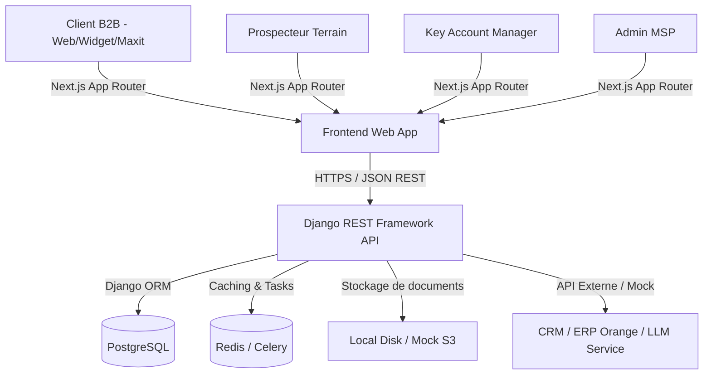
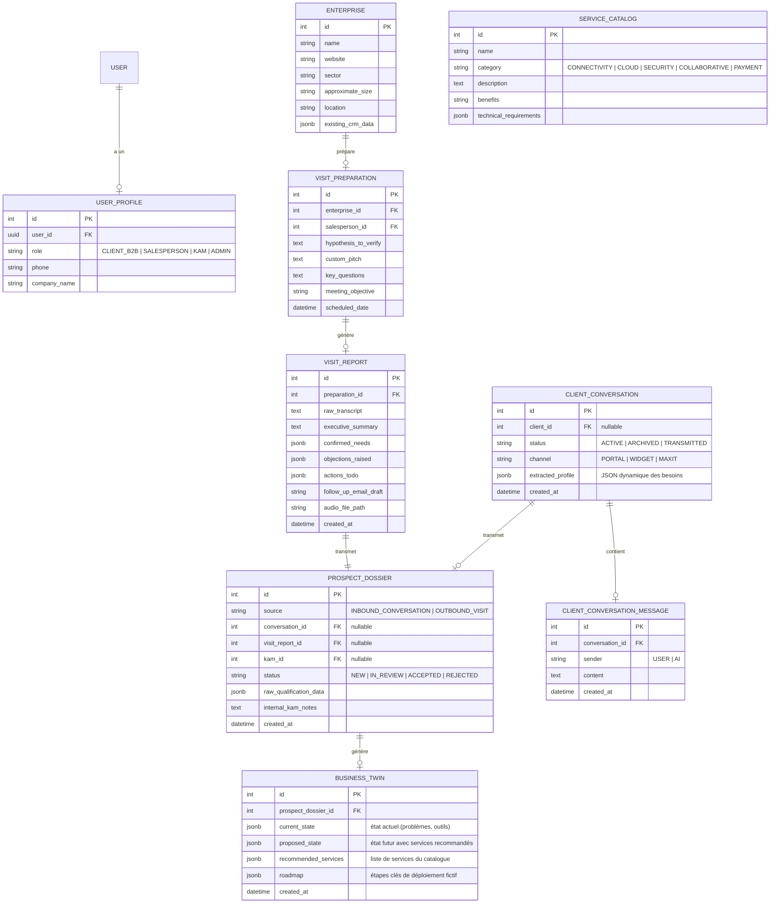
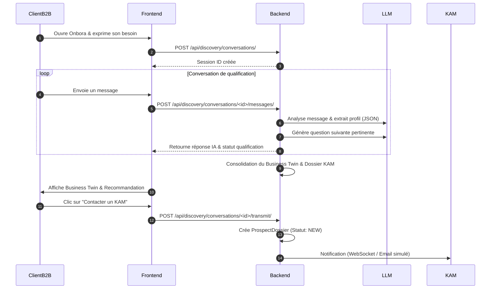

# Architecture Technique et Spécifications — Onbora

Dernière mise à jour : 17 juillet 2026

Ce document définit les spécifications d'architecture d'**Onbora**, un copilote commercial B2B pour MSP (Services Managés). L'implémentation est planifiée avec une stack **Next.js** pour le frontend et **Django REST Framework (DRF)** pour le backend.

---

## 1. Résumé Technique & Stack Optionnelle

Onbora est conçu selon un modèle d'architecture découplée :
*   **Frontend (Next.js)** : Application web réactive conçue avec l'App Router.
    *   *Design System & Styles* : Vanilla CSS ou Tailwind CSS (avec calibrage de couleurs neutres, typographie Geist/Satoshi, et pas de "AI Purple/Blue" cliché).
    *   *Icônes* : Phosphor Icons ou Radix Icons.
    *   *Animations* : Framer Motion (physique spring pour micro-interactions tactiles).
*   **Backend (Django REST Framework - DRF)** : API robuste pour la logique métier, la gestion des sessions conversationnelles, les briefs, la génération documentaire, et le stockage des données.
*   **Base de données** : PostgreSQL pour les données structurées et relationnelles.
*   **Cache & Files d'attente** : Redis pour le cache des sessions LLM et la file de tâches asynchrones de traitement audio / génération PDF.
*   **Stockage de fichiers** : Stockage local (simulant S3) pour les audios, rapports exportés, et documents de formation.
*   **Conteneurisation** : Docker & Docker Compose pour un déploiement et des environnements de développement homogènes.



---

## 2. Hypothèses et Contraintes

1.  **Données de Démonstration (Mock)** : Pour le MVP, les intégrations avec les outils réels d'Orange Business (CRM, ERP, provisioning technique) ou des API d'analyse d'entreprises seront entièrement simulées par de faux connecteurs isolés.
2.  **Traitement Audio Simulé** : Le traitement de l'enregistrement de visite du commercial (transcription, extraction d'insights) possédera une couche d'intégration OpenAI Whisper / LLM, mais pourra basculer sur un mode mock local en cas d'absence de clés API.
3.  **Contraintes UI (Design Taste Enforced)** :
    *   Typographie exclusive : Sans-Serif haut de gamme (`Geist` / `Geist Mono` ou `Satoshi` / `JetBrains Mono`).
    *   Aucun emoji dans le code ou l'UI.
    *   Design sombre ou neutre (base Zinc/Slate) avec un accent unique (par exemple Emerald `#10b981` ou Electric Blue).
    *   Aucun dégradé violet néon / bleu typique des clichés IA.

---

## 3. Découpage en Modules Backend

Le backend Django sera divisé en plusieurs applications spécifiques :

*   `accounts` : Gestion des utilisateurs et de leurs profils associés à des rôles spécifiques (Client B2B, Commercial, KAM, Admin).
*   `catalog` : Gestion des services du catalogue MSP (catégories, caractéristiques techniques, critères de compatibilité, règles de recommandation).
*   `discovery` : Gestion des conversations de qualification du client B2B, de l'historique et de l'extraction automatique du profil de besoin (JSON).
*   `sales` : Gestion des fiches d'entreprises, de la génération de briefs avant-visite, du traitement des visites terrain (audio, transcription, rapport automatique, email de suivi).
*   `kam` : Gestion du cycle de vie du prospect qualifié (workspace KAM, affectation, notes internes, validation ou rejet de la prise en charge).
*   `twin` : Moteur de génération et de stockage du **Business Twin** (représentation simplifiée Avant/Après, roadmap d'évolution).
*   `training` : Contenus de formation post-intégration (guides de prise en main, FAQ, tutoriels interactifs).
*   `reporting` : Suivi analytique des conversions, des origines des prospects, et de l'usage des livrables commerciaux.

---

## 4. Modèle de Données (Schema PostgreSQL)

Voici le schéma relationnel principal pour le MVP d'Onbora :



---

## 5. Spécifications des API (Contrats REST principaux)

### 5.1 Authentification / Utilisateurs
*   `POST /api/auth/login/` : Connexion simple, retourne un JWT token et le rôle de l'utilisateur.
*   `GET /api/auth/me/` : Retourne le profil utilisateur actuel et ses permissions.

### 5.2 Client B2B (Inbound)
*   `POST /api/discovery/conversations/` : Crée une nouvelle session de qualification (widget, Maxit, portail).
*   `POST /api/discovery/conversations/<id>/messages/` : Envoie un message utilisateur, retourne la réponse de l'IA (en asynchrone ou streaming) et met à jour en arrière-plan `extracted_profile`.
*   `GET /api/discovery/conversations/<id>/recommendations/` : Retourne les services recommandés basés sur le profil extrait.

### 5.3 Prospecteur (Outbound)
*   `GET /api/sales/enterprises/search/?q=<query>` : Recherche d'entreprise (scraped + CRM interne).
*   `POST /api/sales/visit-preparations/` : Crée/génère un brief avant-visite pour une entreprise ciblée.
*   `POST /api/sales/visit-reports/` : Envoie les notes ou l'audio de la visite pour transcrire et générer automatiquement le rapport, les tâches et l'email de suivi.

### 5.4 KAM (Workspace)
*   `GET /api/kam/dossiers/` : Liste tous les dossiers prospects (inbound ou outbound), triables par statut (Nouveau, En revue, Accepté).
*   `PATCH /api/kam/dossiers/<id>/` : Modifie le statut, assigne un KAM, ou ajoute des notes internes.
*   `GET /api/kam/dossiers/<id>/business-twin/` : Récupère le Business Twin généré pour ce prospect.

### 5.5 Formation & Adoption
*   `GET /api/training/dashboard/` : Liste les services activés par le MSP pour le client B2B et propose les modules de formation associés.

---

## 6. Flux Critiques

### Flux de Qualification Client Inbound (Maxit / Widget)


---

## 7. Sécurité et Confidentialité

1.  **Contrôle d'Accès basé sur les Rôles (RBAC)** :
    *   Les endpoints `/api/kam/*` sont strictement réservés aux utilisateurs avec le rôle `KAM` ou `ADMIN`.
    *   Les endpoints `/api/sales/*` sont réservés aux `SALESPERSON` et `ADMIN`.
    *   Les clients B2B ont uniquement accès à leurs propres sessions conversationnelles de découverte et de formation post-intégration (filtrage par token de session ou authentification client).
2.  **Protection des Données Prospects** :
    *   Toutes les données extraites et les rapports doivent être chiffrés en base de données.
    *   Les fichiers audios de transcription doivent être stockés dans un dossier sécurisé non public avec un accès restreint par signature d'URL.
3.  **Filtrage LLM (Prompt Injection Guard)** :
    *   Le module `discovery` implémentera des prompts système robustes limitant l'IA à des sujets liés aux services MSP, interdisant la négociation de prix réels ou l'expression d'engagements contractuels.

---

## 8. Structure des Dossiers du Projet

Pour implémenter cette architecture, le projet Onbora sera structuré de la manière suivante :

```text
onbora/
├── backend/                  # Projet Django REST Framework
│   ├── manage.py
│   ├── requirements.txt
│   ├── Dockerfile
│   ├── onbora/               # Config globale du projet Django
│   │   ├── __init__.py
│   │   ├── settings.py
│   │   ├── urls.py
│   │   └── wsgi.py
│   ├── accounts/             # App Django - Profils & Authentification
│   ├── catalog/              # App Django - Catalogue MSP
│   ├── discovery/            # App Django - Copilot Client B2B
│   ├── sales/                # App Django - Copilot Prospecteur
│   ├── kam/                  # App Django - Workspace KAM
│   ├── twin/                 # App Django - Business Twin
│   ├── training/             # App Django - Formation & Adoption
│   └── reporting/            # App Django - Dashboard Admin MSP
│
├── frontend/                 # Application Next.js
│   ├── package.json
│   ├── tsconfig.json
│   ├── tailwind.config.js    # Si applicable
│   ├── postcss.config.js     # Si applicable
│   ├── Dockerfile
│   ├── public/
│   └── src/
│       ├── app/              # Next.js App Router (Layouts & Pages)
│       │   ├── page.tsx      # Landing page / redirection selon rôle
│       │   ├── client/       # Espace Client B2B
│       │   ├── sales/        # Espace Prospecteur
│       │   ├── kam/          # Workspace KAM
│       │   ├── admin/        # Dashboard Admin MSP
│       │   └── layout.tsx
│       ├── components/       # Composants partagés (Chat, BusinessTwin visualizer, Layouts)
│       │   ├── ui/
│       │   └── shared/
│       └── lib/              # API fetch helpers, utilities, hooks
│
├── docker-compose.yml        # Configuration de l'environnement multi-conteneurs
└── README.md                 # Documentation globale d'installation
```

---

## 9. Handoff for Tasks (Plan d'Action Immédiat)

Voici les lots de travail pour lancer la phase d'implémentation de la **Priorité 1** :

1.  **Scaffolding Backend (Django)** :
    *   Initialiser le projet Django et créer les applications listées dans la structure.
    *   Définir le `requirements.txt` avec `django`, `djangorestframework`, `psycopg2-binary`, `django-cors-headers`, `gunicorn`.
    *   Configurer le fichier `settings.py` (CORS, bases de données PostgreSQL, middleware, etc.).
2.  **Scaffolding Frontend (Next.js)** :
    *   Initialiser l'application Next.js (App Router, TypeScript).
    *   Créer les répertoires `/src/app/client/`, `/src/app/sales/`, `/src/app/kam/`, `/src/app/admin/`.
    *   Configurer les bases de style (paddings, polices d'écriture premium, variables CSS pour le thème de couleur).
3.  **Scaffolding Docker** :
    *   Créer les `Dockerfile` pour le backend et le frontend.
    *   Créer le `docker-compose.yml` déclarant les services : `db` (PostgreSQL), `redis` (Redis), `backend` et `frontend`.
4.  **Initialisation Git** :
    *   Créer un dépôt Git local dans le répertoire `Onbora`.
    *   Configurer les fichiers `.gitignore` pour Next.js et Django.
