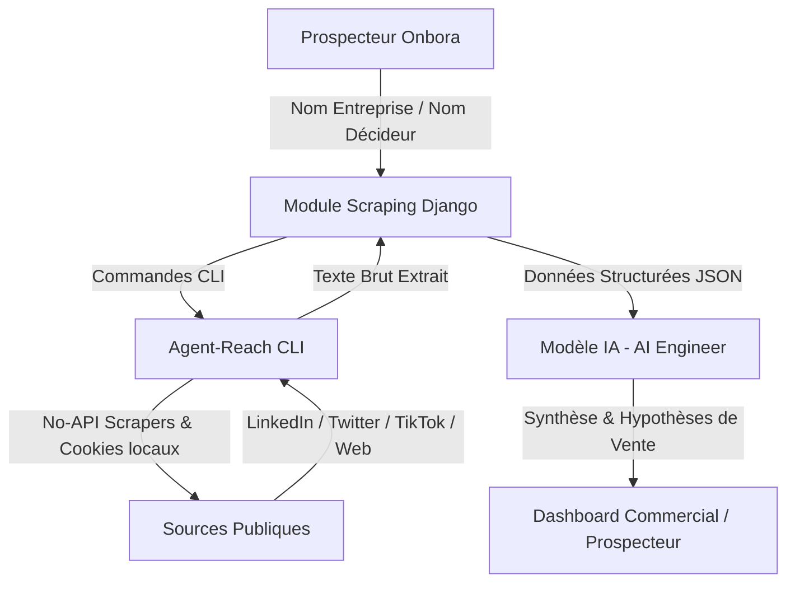

# Contexte de Scraping & Profilage Décisionnaire (Onbora)

Ce document définit les spécifications, le flux opérationnel et le modèle de données du module de scraping automatisé d'Onbora, conçu pour alimenter l'analyse de profilage de l'AI Engineer.

---

## 1. Objectifs du Scraping & Rôle d'Onbora
Le succès d'une démarche de prospection repose sur une hyper-personnalisation. Le rôle du module de scraping d'Onbora est de récolter des données publiques multi-plateformes sur les **décisionnaires** d'une entreprise cible avant la visite commerciale.

Ces informations brutes sont ensuite traitées par le moteur de l'AI Engineer pour :
1.  **Profiler la psychologie & les intérêts** du décideur.
2.  **Identifier des points d'accroche** personnalisés (ice-breakers) basés sur ses publications récents ou ses hobbies.
3.  **Établir des hypothèses de besoins techniques** (ex: s'il s'intéresse à la cybersécurité ou s'il se plaint de pannes réseau sur les réseaux sociaux).

---

## 2. Stratégie de Scraping par Étapes

### Étape 1 : Cartographie des Décisionnaires (Organigramme)
*   **Action** : Recherche sur les moteurs publics et LinkedIn pour identifier les rôles clés de l'entreprise cible (CEO, CTO, Directeur Informatique/DSI, CFO).
*   **Sources** : Google Search, LinkedIn Company Page, page "Équipe" du site web officiel.

### Étape 2 : Profilage Professionnel (LinkedIn)
*   **Action** : Extraction des données du profil du décideur identifié.
*   **Métriques clés** :
    *   Titre exact & parcours professionnel.
    *   Sujets abordés dans ses derniers posts (activité récente).
    *   Groupes d'intérêt et compétences validées.

### Étape 3 : Profilage Personnel & Vibe Check (Facebook, TikTok, Twitter/X)
*   **Action** : Recherche de comptes publics associés sur les plateformes grand public pour détecter le ton de communication et les centres d'intérêt informels.
*   **Métriques clés** :
    *   Sujets récurrents, ton de communication (formel/passionné/technique).
    *   Mentions de problématiques professionnelles vécues ou partagées.

### Étape 4 : Diagnostic Technique du Site Web (si existant)
*   **Action** : Analyse passive des technologies utilisées sur leur site internet (ex: CMS, outils de tracking, certificat SSL).
*   **Métriques clés** : CMS (WordPress/Shopify), vulnérabilités apparentes, hébergeur détecté.

---

## 3. Architecture d'Intégration d'Agent-Reach
Pour éviter des frais d'API prohibitifs (LinkedIn API, X API, etc.), Onbora s'appuie sur la philosophie open-source du projet **Agent-Reach** :



### Avantages d'Agent-Reach pour Onbora :
1.  **Multi-canal unifié** : Permet de requêter 13+ sources (Twitter, TikTok, YouTube, Reddit, Github, etc.) via une interface CLI commune.
2.  **Zéro frais d'API** : Utilise des techniques de requêtes publiques et de récupération de DOM légères.
3.  **Résilience / Self-healing** : Le mécanisme `agent-reach doctor` bascule automatiquement sur des canaux de secours si une plateforme change sa structure HTML.

---

## 4. Modèle de Données JSON (Spécification de Sortie)

Voici le schéma JSON structuré généré par le module de scraping d'Onbora et transmis à l'AI Engineer :

```json
{
  "scraping_session": {
    "timestamp": "2026-07-26T19:45:00Z",
    "status": "success",
    "target_company": "École Lumière"
  },
  "company_profile": {
    "name": "École Lumière",
    "official_website": "https://ecole-lumiere.cd",
    "sector": "Éducation / Enseignement",
    "estimated_size": "25-50 employés",
    "tech_stack_detected": ["WordPress", "Google Workspace", "Cloudflare"]
  },
  "decision_makers": [
    {
      "name": "Jean-Marc Kabulo",
      "role": "Directeur Informatique (DSI)",
      "confidence_score": 0.95,
      "linkedin_data": {
        "url": "https://linkedin.com/in/jmkabulo-dsi",
        "headline": "DSI chez École Lumière | Passionné de EdTech & Cloud",
        "recent_posts": [
          "Superbe rentrée scolaire sous le signe du numérique. Merci à nos équipes.",
          "La sécurité des données de nos élèves est notre priorité absolue face aux ransomwares."
        ],
        "skills": ["Infrastructures Réseau", "Cybersécurité", "Google Classroom"]
      },
      "social_fingerprint": {
        "twitter_handle": "@jmkabulo",
        "recent_tweets": [
          "Encore une coupure de fibre ce matin... Le backup 4G nous a sauvés, mais le débit est trop juste."
        ],
        "tiktok_interests": ["Educational tech tips", "DIY hardware"],
        "overall_tone": "Technique, axé sur l'innovation et la résilience réseau"
      }
    }
  ]
}
```
