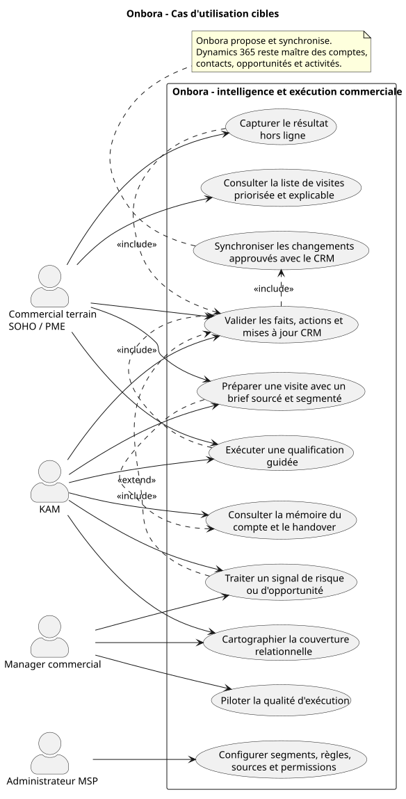
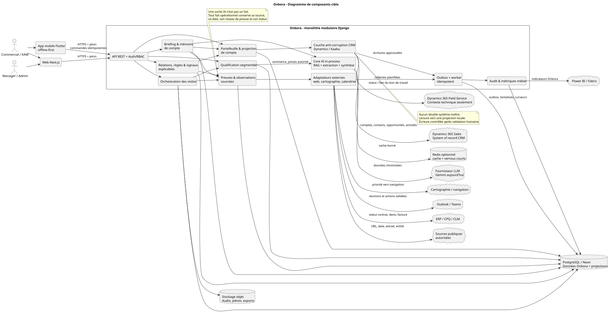
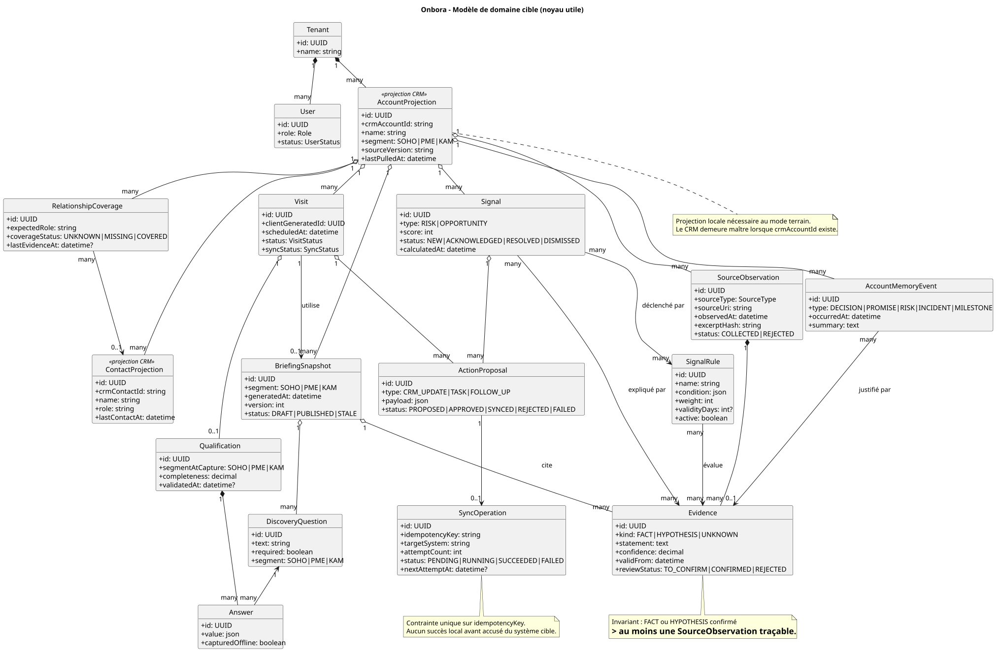
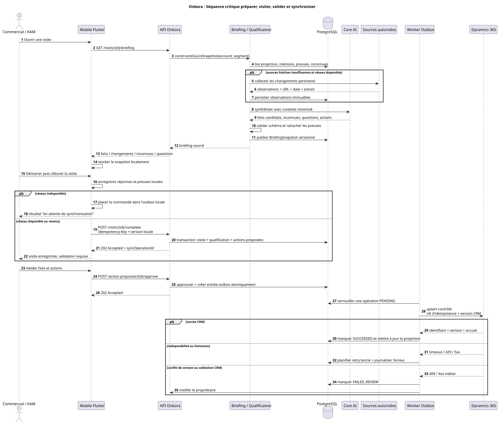
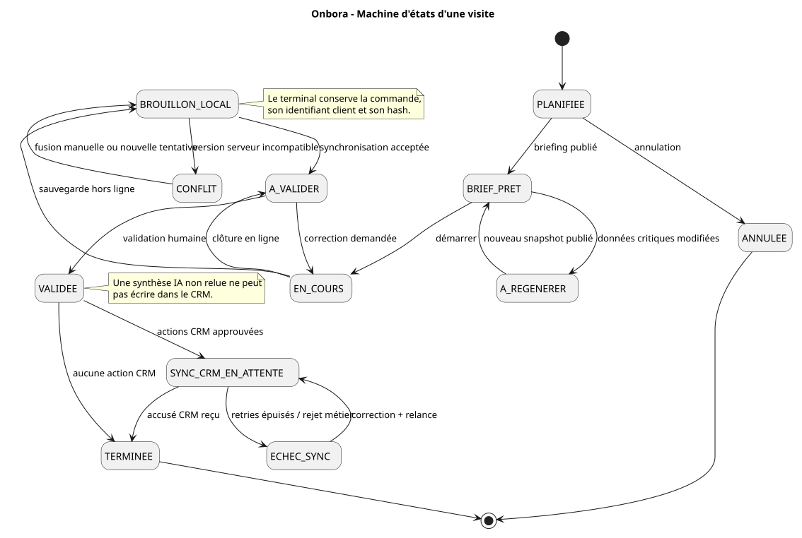
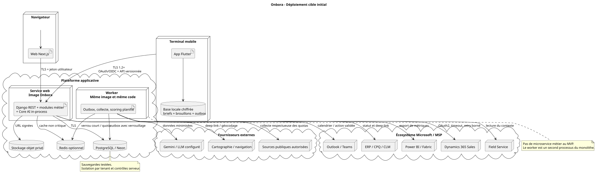

# Onbora — Architecture cible et dossier UML

Version proposée : 1.0  
Horizon : pilote de 8 à 12 semaines, puis industrialisation progressive  
Mode d'entrée : analyse du rapport produit/concurrence + vérification du dépôt existant

<!-- architecture-section: executive-verdict -->
## Executive Verdict

- **Recommandation :** faire d'Onbora une couche de renseignement commercial sourcé et d'exécution terrain, construite comme un monolithe Django modulaire avec application mobile offline-first et couche anti-corruption vers Dynamics 365/Kaabu.
- **Pourquoi ce choix :** il préserve l'existant Next.js, Flutter, Django, PostgreSQL et Core AI tout en réservant à Onbora les données qui le différencient : preuves, inconnues, briefings, qualifications, mémoire, couverture relationnelle, signaux explicables et actions proposées.
- **Risque principal :** créer malgré tout un CRM parallèle dans `Enterprise`, puis subir des conflits de données, des scores contradictoires et des synchronisations déclarées réussies sans accusé réel du CRM.
- **À décider maintenant :** propriété de chaque donnée, validation humaine avant écriture CRM, contrat d'idempotence mobile/CRM et modèle de preuve.
- **Peut attendre :** microservices, bus Kafka/RabbitMQ, base graphe, optimisation multi-tournées et prédiction ML du churn.
- **Confiance :** élevée sur les frontières fonctionnelles ; moyenne sur les objectifs non fonctionnels tant que le volume, les contraintes de résidence et les SLA Dynamics ne sont pas mesurés.

<!-- architecture-section: project-frame -->
## Project Frame

### Objectifs

- Réduire le temps de préparation et les surprises commerciales grâce à des informations traçables.
- Garantir une qualification adaptée aux parcours SOHO, PME et KAM, y compris sans réseau.
- Transformer les observations et validations en actions contrôlées dans le CRM existant.

### Non-objectifs

- Remplacer Dynamics 365 Sales, Field Service, ERP, CPQ, CLM, Outlook, Teams ou Power BI.
- Résoudre par logiciel les conflits de gouvernance, de P&L, de ressources ou de stratégie produit.
- Introduire des prédictions opaques ou une orchestration automatique des systèmes externes.

### Contraintes observées

- Préserver le monolithe Django modulaire, le Core AI in-process, Next.js, Flutter et PostgreSQL/Neon.
- Supporter les usages terrain intermittents et les marchés/sources locales.
- Faire coexister le CRM Kaabu existant et une cible Dynamics 365 derrière un contrat commun.

<!-- architecture-section: evidence-and-assumptions -->
## Evidence, Assumptions, and Unknowns

| Élément | Type | Confiance | Impact si faux | Validation |
|---|---|---:|---|---|
| Le dépôt utilise Django, Next.js, Flutter et PostgreSQL/Neon | Fait vérifié dans le dépôt | Élevée | La topologie cible devrait être revue | CI et inventaire de déploiement |
| Dynamics/Kaabu doit rester maître des objets CRM | Décision rapportée | Élevée | Risque de CRM parallèle | Validation sponsor MSP + mapping Dataverse |
| Le terrain exige un fonctionnement hors ligne transactionnel | Besoin rapporté et inféré | Élevée | La base locale/outbox pourrait être simplifiée | Pilote en zones de connectivité représentatives |
| Un worker du monolithe suffit au pilote | Hypothèse | Moyenne | Backlog de synchro ou latence excessive | Mesurer débit, retries et âge maximal de l'outbox |
| Le produit sera multi-tenant | Hypothèse prudente | Moyenne | Le modèle d'autorisation et les clés changent | Décision commerciale et IAM du MSP |
| Les SLA, volumes et règles de résidence sont inconnus | Inconnu | Élevée | Empêche de fixer disponibilité et RPO/RTO définitifs | Atelier exploitation, juridique et sécurité |

## 1. Verdict sur l'analyse fournie

L'analyse produit est cohérente : la meilleure position d'Onbora n'est ni « nouveau CRM », ni « Field Service simplifié », ni « IA qui résume le CRM ». Le produit doit posséder le cycle suivant :

`préparer avec preuves -> visiter -> qualifier -> faire valider -> synchroniser -> enrichir la mémoire -> recalculer les signaux`

La frontière fondamentale est la suivante :

| Domaine | Système maître | Copie ou donnée Onbora | Règle d'écriture |
|---|---|---|---|
| Compte, contact, lead, opportunité, activité | Dynamics 365/CRM MSP | Projection locale minimale pour lecture rapide et offline | Mise à jour uniquement après validation et contrôle de version |
| Bon de travail, dispatch technique, actifs, pièces | Dynamics Field Service/FSM | Identifiant, statut et deep-link | Pas d'orchestration du cycle technique |
| Devis, remise, contrat, facture | ERP/CPQ/CLM | Statut, échéance, blocage et impact commercial | Aucun calcul contractuel dans Onbora |
| Réunion et collaboration | Outlook/Teams | Référence de réunion et actions approuvées | Synchronisation ciblée |
| Briefing, qualification, visite, mémoire, couverture relationnelle | Onbora | Donnée native Onbora | Écriture auditée et versionnée |
| Observation publique, source, preuve, inconnue | Onbora | Donnée native Onbora | Une observation n'est jamais promue en fait sans règle de preuve |
| Scoring risque/opportunité | Onbora | Règles, métriques, déclencheurs et résultat | Toujours explicable ; l'IA peut assister, pas décider |

## 2. Diagnostic du dépôt actuel

### Fondations à conserver

- Monolithe modulaire Django sous `backend/apps/`, adapté à l'équipe et au stade du produit.
- Web Next.js et mobile Flutter correspondant aux usages bureau et terrain.
- PostgreSQL/Neon comme source de vérité Onbora.
- Core AI in-process, contrats JSON et validation humaine déjà amorcée.
- Modèles existants utiles : `Enterprise`, `VisitPreparation`, `VisitReport`, `KamVisitReport`, `PreCallBriefing`, `ScoreProfile`, `ScoreRule` et `AccountScoreResult`.
- Adaptateurs Kaabu et ArrowSphere déjà isolés sous `sales/integrations/`.

### Écarts structurants à corriger

1. **La synchronisation Dynamics est simulée.** `PostCallSyncCrmView` marque actuellement un rapport `SYNCED_DYNAMICS` sans appel ni accusé externe. Le nouvel état de succès doit dépendre d'un accusé du connecteur et conserver l'identifiant/version retournés.
2. **`Enterprise` agit encore comme CRM local.** À terme, les champs CRM doivent être considérés comme une projection avec provenance, version source et date de rafraîchissement. Les données exclusivement Onbora restent séparées.
3. **Le mobile n'est pas encore offline-first au sens transactionnel.** `SharedPreferences` et des fallbacks de lecture ne suffisent pas. Il faut une base locale chiffrée, une outbox persistante et des commandes idempotentes.
4. **Deux logiques de scoring coexistent.** Les sorties `ai_lead_scoring_data`/`ai_churn_data` ne doivent pas piloter seules une action. Le moteur `ScoreProfile`/`ScoreRule` doit devenir la référence opérationnelle explicable.
5. **Le déploiement documenté diverge.** Le contexte annonce un Core AI in-process, tandis que `docker-compose.yml` conserve un conteneur `core-ai`. La cible retient un seul Core AI in-process ; le conteneur historique doit être retiré après vérification des appels restants.

<!-- architecture-section: critical-flows -->
## Critical Flows

1. **Préparer :** identité -> autorisation portefeuille -> projection CRM -> preuves fraîches -> synthèse IA validée par schéma -> snapshot versionné -> consultation mobile.
2. **Visiter hors ligne :** brief local -> capture -> outbox mobile persistante -> rejeu idempotent -> transaction serveur -> accusé visible.
3. **Écrire dans le CRM :** action proposée -> validation humaine -> outbox serveur -> adaptateur CRM -> accusé externe ou conflit explicite.
4. **Calculer un signal :** métriques datées -> règles versionnées -> preuves déclenchantes -> score explicable -> action assignée ou rejet motivé.

<!-- architecture-section: architecture -->
## 3. Dossier UML

Les fichiers PlantUML sont les sources modifiables. Les SVG générés servent à la lecture et à la revue.

### 3.1 Cas d'utilisation et responsabilités humaines

Source : [`uml/01-cas-utilisation.puml`](uml/01-cas-utilisation.puml)

Ce diagramme montre notamment que la validation humaine est incluse dans toute écriture CRM. Il évite de présenter Onbora comme autorité sur les contrats, les opportunités ou les interventions techniques.

### 3.2 Composants et frontières de systèmes

Source : [`uml/02-composants.puml`](uml/02-composants.puml)

Le composant clé est la couche anti-corruption CRM. Elle traduit les objets Dynamics/Kaabu en projections Onbora et empêche les modèles externes de contaminer le domaine métier. L'outbox est une table PostgreSQL traitée par un second processus du même monolithe, pas une nouvelle plateforme distribuée.

### 3.3 Modèle de domaine

Source : [`uml/03-modele-domaine.puml`](uml/03-modele-domaine.puml)

Les trois abstractions les plus importantes sont :

- `AccountProjection`, qui matérialise le compte CRM sans en devenir le maître ;
- `SourceObservation` + `Evidence`, qui distinguent observation, hypothèse, inconnue et fait confirmé ;
- `ActionProposal` + `SyncOperation`, qui séparent proposition, approbation humaine et effet externe réellement confirmé.

### 3.4 Séquence critique de bout en bout

Source : [`uml/04-sequence-visite.puml`](uml/04-sequence-visite.puml)

La séquence couvre le chemin nominal, le mode hors ligne, le retour du réseau, l'idempotence, l'indisponibilité CRM et le conflit de version.

### 3.5 Cycle de vie d'une visite

Source : [`uml/05-cycle-de-vie-visite.puml`](uml/05-cycle-de-vie-visite.puml)

Les états `BROUILLON_LOCAL`, `CONFLIT`, `A_VALIDER`, `SYNC_CRM_EN_ATTENTE` et `ECHEC_SYNC` rendent visibles des situations que l'interface ne doit jamais masquer derrière un simple bouton « synchronisé ».

<!-- architecture-section: deployment-and-operations -->
### 3.6 Déploiement initial

Source : [`uml/06-deploiement.puml`](uml/06-deploiement.puml)

Le service web et le worker utilisent la même image et le même code. Cette séparation de processus suffit pour isoler les appels lents et les retries sans coût cognitif de microservices.

<!-- architecture-section: decisions-and-trade-offs -->
## 4. Décisions d'architecture

### ADR-001 — Couche d'intelligence connectée, pas CRM parallèle

**Statut : proposé**

| Option | Avantages | Limites | Verdict |
|---|---|---|---|
| Refaire un CRM complet dans Onbora | Contrôle total de l'UX | Duplication, conflits, coût élevé, faible différenciation | Rejetée |
| Tout configurer dans Power Platform/Dynamics | Moins de produit à maintenir | Dépendance Microsoft, UX terrain et sources locales moins distinctives | Viable pour certains clients, mais insuffisant pour le produit Onbora |
| Couche Onbora avec projections et adaptateurs | Différenciation claire, intégrable à plusieurs CRM, offline maîtrisable | Exige contrats de synchronisation et gouvernance de données | **Retenue** |

**Conséquences obligatoires :** identifiant externe, version source, dernière lecture, journal des écritures, gestion des conflits et aucun état `SYNCED` sans accusé externe.

### ADR-002 — Monolithe modulaire + worker, pas microservices

**Statut : proposé**

Le dépôt contient déjà des bounded contexts Django et un Core AI in-process. La cible garde un seul déploiement logique, complété par un worker de la même image. Un découpage en services ne devient justifié que si une frontière d'équipe, une charge mesurée ou une exigence d'isolation l'impose.

### ADR-003 — Règles explicables comme autorité du scoring

**Statut : proposé**

Le score opérationnel est calculé à partir de règles versionnées, métriques datées et preuves visibles. Un LLM peut extraire un signal candidat ou expliquer le résultat, mais ne peut ni inventer une preuve, ni déclencher seul une écriture CRM.

### ADR-004 — Outbox transactionnelle pour les effets externes

**Statut : proposé**

L'approbation d'une action et la création de son opération de synchronisation sont enregistrées dans une même transaction PostgreSQL. Le worker effectue des retries bornés et idempotents. Cette option est plus simple qu'un broker au pilote et évite la perte d'une action entre commit local et appel CRM.

<!-- architecture-section: data-and-contracts -->
## 5. Contrats et invariants

### API mobile

- Chaque commande de clôture ou synchronisation transporte `Idempotency-Key`, `clientGeneratedId`, `deviceId`, version locale et hash du contenu.
- Une même clé avec un contenu différent est rejetée.
- La réponse distingue `ACCEPTED`, `CONFLICT`, `VALIDATION_ERROR` et `ALREADY_PROCESSED`.
- Les listes sont paginées et les synchronisations utilisent un curseur, pas un téléchargement complet du portefeuille.

### Preuve et IA

- Toute information est typée `FACT`, `HYPOTHESIS` ou `UNKNOWN`.
- Un `FACT` confirmé référence au moins une observation traçable ou une validation humaine auditée.
- La source conserve URI, date d'observation, entité concernée, extrait ou empreinte, et droits d'utilisation.
- Les prompts et logs ne contiennent pas de secrets, jetons, audio brut ni données personnelles superflues.

### Synchronisation CRM

- Lecture : pull incrémental ou webhook, projection locale et conservation du curseur/version.
- Écriture : action proposée -> approbation -> outbox -> adaptateur -> accusé externe.
- Conflit : aucune écrasement silencieux ; comparaison de versions et revue humaine pour les champs métier.
- Retry : uniquement sur erreurs transitoires ; les erreurs métier passent en `FAILED_REVIEW`.

<!-- architecture-section: quality-scenarios -->
## 6. Scénarios de qualité provisoires

Ces valeurs sont des cibles de pilote, pas des mesures déjà obtenues.

| ID | Scénario observable | Cible provisoire | Preuve attendue |
|---|---|---|---|
| NFR-01 | Un commercial clôture une visite sans réseau | Zéro perte ; reprise après redémarrage du mobile | Test E2E mode avion + kill/restart |
| NFR-02 | La même commande mobile est livrée plusieurs fois | Un seul rapport et une seule action externe | Test de rejeu concurrent |
| NFR-03 | Dynamics est indisponible | La visite reste validée localement, l'action est visible en attente, aucun faux succès | Test de panne avec retries bornés |
| NFR-04 | Un utilisateur tente un accès inter-tenant | Refus serveur systématique et trace d'audit | Tests d'autorisation positifs/négatifs |
| NFR-05 | Un briefing est consulté sur réseau normal | p95 inférieur à 2 s si snapshot frais ; retour immédiat du dernier snapshot si dépendance IA indisponible | Mesures APM pilote |
| NFR-06 | Une alerte est affichée | 100 % des points du score renvoient vers règle, métrique et date | Test de contrat du résultat de scoring |
| NFR-07 | Une sauvegarde est restaurée | RPO/RTO à fixer avec le MSP ; restauration répétée en environnement de test | Exercice de restauration |

<!-- architecture-section: trust-and-security -->
## 7. Sécurité et frontières de confiance

- Isolation par tenant appliquée dans les repositories/services propriétaires, jamais à partir d'un `tenant_id` cru fourni par le client.
- Permissions distinctes pour commercial, KAM, manager et administrateur ; accès au portefeuille limité aux affectations autorisées.
- Jetons Dynamics/Kaabu stockés dans un gestionnaire de secrets et jamais dans les journaux.
- Chiffrement de la base mobile locale et effacement des données lors de la révocation de l'appareil.
- URLs publiques collectées validées contre SSRF, taille et type de contenu limités, quotas par source et respect des conditions d'utilisation.
- Audio et documents placés dans un stockage privé avec URL signée et politique de rétention, pas sur le disque éphémère du service web.

## 8. Évolution par étapes

### Initial — pilote P0

1. Introduire `AccountProjection` conceptuellement sans migration brutale : enrichir `Enterprise` avec version/provenance, puis isoler les accès derrière un repository.
2. Implémenter preuves, observations, briefing versionné et qualification par segment.
3. Ajouter base locale mobile + outbox persistante + endpoints idempotents.
4. Remplacer le faux succès Dynamics par un adaptateur réel ou, tant que l'adaptateur n'existe pas, afficher explicitement `SIMULATION`.
5. Utiliser `ScoreProfile`/`ScoreRule` comme moteur officiel de priorité.

### Croissance P1

1. Ajouter mémoire de compte, couverture relationnelle et handover.
2. Ajouter worker outbox, collectes planifiées et tableau de supervision des échecs.
3. Brancher Dynamics 365, calendrier et statut Field Service avec tests de contrat.
4. Mesurer temps de préparation, complétude, délai de relance et taux de signaux confirmés.

### Mature, seulement sur signal mesuré

- Broker dédié si l'outbox PostgreSQL sature, si plusieurs équipes consomment les événements ou si l'isolation des pannes l'exige.
- Service séparé d'ingestion si les collectes web consomment durablement les ressources du backend interactif.
- Read model ou moteur de recherche spécialisé si les requêtes de mémoire ne respectent plus les budgets de latence PostgreSQL.
- Déploiement multi-région uniquement après exigence de résidence/disponibilité et tests de cohérence.

<!-- architecture-section: architecture-stress-test -->
## 9. Stress test de l'architecture

- **Échec le plus probable :** qualité insuffisante des données CRM et des sources, donnant des briefings élégants mais peu fiables. Réponse : afficher les inconnues, la fraîcheur et le taux de couverture des preuves comme métriques de produit.
- **Hypothèse qui invaliderait le plus le design :** un client refuse toute copie locale de données CRM. Il faudrait alors un mode sans projection persistante, avec cache court et capacités offline réduites.
- **Alternative moins chère :** Power Apps + Dataverse + Copilot Studio. Elle est suffisante si le client est exclusivement Microsoft, accepte une UX standard et n'a pas besoin d'un produit multi-CRM ni d'une forte différenciation locale.
- **Signal d'évolution :** backlog d'outbox durable au-delà du délai métier convenu, saturation DB mesurée, besoin d'équipes autonomes ou p95 hors budget après optimisation requise.

<!-- architecture-section: validation-plan -->
## 10. Validation et Handoff for Tasks

### Validation à exécuter

- Tests de contrat Dynamics/Kaabu avec sandbox ou serveur factice contrôlé.
- Tests de rejeu, duplication, conflit de version, panne et reprise du mobile.
- Tests d'isolation tenant et de permissions par rôle.
- Tests de schéma garantissant qu'un fait confirmé possède une preuve.
- Test de panne LLM : utilisation d'un snapshot existant ou d'un briefing déterministe, sans faux fait.
- Exercice de restauration PostgreSQL et vérification du rapprochement des outbox.

<!-- architecture-section: handoff-for-tasks -->
### Ordre de livraison recommandé

1. Contrats de données et migration compatible : preuve, snapshot, action, sync operation.
2. Repositories séparant projection CRM et données natives Onbora.
3. Commandes idempotentes et outbox serveur.
4. Stockage local chiffré et outbox mobile.
5. Briefing et qualification segmentés sur les nouveaux contrats.
6. Adaptateur Dynamics réel avec feature flag et mode shadow.
7. Radar explicable et dashboard de qualité.
8. Mémoire, couverture relationnelle et handover.

### Critères de rollout / rollback

- Déployer d'abord en lecture seule et en mode shadow : comparer les propositions Onbora aux mises à jour réellement validées.
- Activer l'écriture CRM par cohorte et par type d'objet.
- Suspendre automatiquement une intégration si le taux d'erreurs ou de conflits dépasse le seuil convenu.
- Le rollback désactive l'envoi externe mais conserve les actions dans l'outbox pour revue ; aucune suppression de données de visite.

<!-- architecture-section: risks-and-deferred-decisions -->
## 11. Décisions encore ouvertes

- Fournisseur d'identité et modèle exact de tenant MSP.
- Région de stockage, durées de rétention et exigences réglementaires locales.
- Dynamics 365 exact : tables Dataverse, champs personnalisés, webhooks disponibles et limites API.
- Stratégie de base locale Flutter et politique MDM/effacement d'appareil.
- Sources publiques autorisées, licences, fréquence de collecte et secteurs prioritaires.
