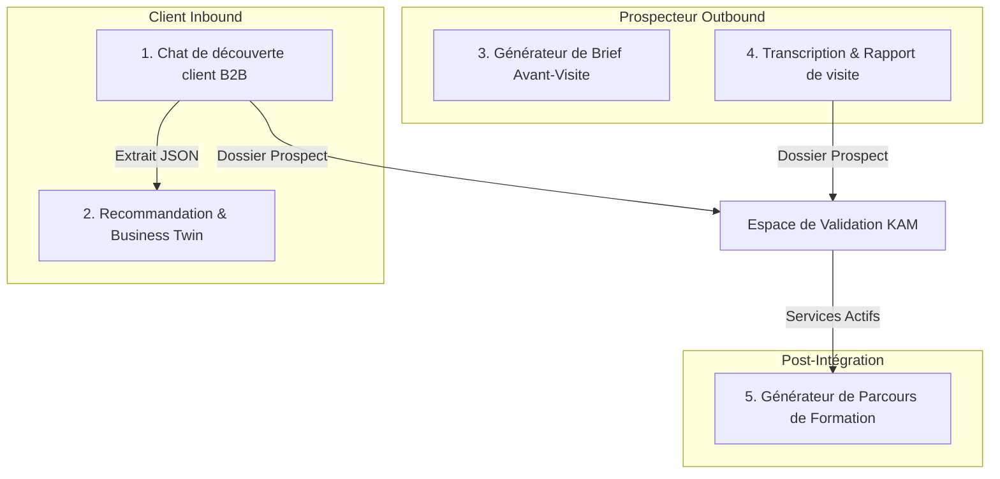

# Intégrations et Points d'Intervention IA — Onbora

Ce document recense tous les points d'intervention de l'Intelligence Artificielle (points de coupure / "break" IA) dans Onbora, détaillant pour chacun les entrées, les tâches attendues, les prompts de base, et les formats de sortie structurés.

---

## 1. Cartographie des Points d'Intervention IA



---

## 2. Spécifications des Modules IA

### 2.1 Chat de Découverte Conversationnelle (Inbound)
*   **Déclencheur** : Réception d'un message client dans `POST /api/discovery/conversations/<id>/messages/`.
*   **Entrées** : Message de l'utilisateur, historique complet de la conversation, catalogue de services MSP (schéma léger).
*   **Rôle de l'IA** :
    1.  Analyser les nouveaux éléments mentionnés par l'utilisateur.
    2.  Mettre à jour le profil de besoin au format JSON.
    3.  Formuler la question suivante de manière fluide (sans faire de liste de questions).
    4.  Évaluer si la qualification est suffisante (`is_qualified = true`).
*   **Format de Sortie (JSON Structuré)** :
    ```json
    {
      "next_question": "Pourriez-vous me préciser combien de sites géographiques votre entreprise possède ?",
      "extracted_profile": {
        "sector": "Médical",
        "company_size_estimate": "50-100",
        "current_problems": ["Réseau lent dans le cabinet secondaire", "Difficulté de collaboration"],
        "current_tools": ["Outlook", "ADSL standard"],
        "locations_count": 2
      },
      "is_qualified": false
    }
    ```

### 2.2 Recommandation et Business Twin (Inbound & Outbound)
*   **Déclencheur** : Fin de la qualification client ou demande manuelle.
*   **Entrées** : Profil de besoin extrait (`extracted_profile`), catalogue complet des services MSP.
*   **Rôle de l'IA** :
    1.  Faire correspondre les problèmes du profil aux services du catalogue.
    2.  Rédiger l'explication / la valeur ajoutée pour chaque service recommandé.
    3.  Créer la situation "Avant/Après" (Business Twin) et les étapes de la roadmap.
*   **Format de Sortie (JSON Structuré)** :
    ```json
    {
      "recommended_services": [
        {
          "service_id": "sdwan-pro-01",
          "priority": "HIGH",
          "reasoning": "Permet de stabiliser et de sécuriser la connexion entre le cabinet principal et secondaire."
        }
      ],
      "business_twin": {
        "current_state": ["Liaison ADSL instable", "Pas de backup réseau"],
        "proposed_state": ["Liaison SD-WAN managée", "Basculement automatique 4G/5G"],
        "transition_steps": [
          "Étape 1 : Diagnostic d'éligibilité fibre",
          "Étape 2 : Installation du routeur SD-WAN",
          "Étape 3 : Configuration des politiques de routage"
        ]
      }
    }
    ```

### 2.3 Générateur de Brief Avant-Visite (Outbound)
*   **Déclencheur** : Recherche d'entreprise par le prospecteur terrain.
*   **Entrées** : Nom de l'entreprise, contenu textuel extrait de son site web public, données historiques CRM.
*   **Rôle de l'IA** : Synthétiser une fiche d'opportunité d'une page avec des conseils tactiques de vente.
*   **Format de Sortie (JSON Structuré)** :
    ```json
    {
      "company_overview": "XYZ Clinique, groupe de santé privé en pleine expansion géographique.",
      "commercial_hypotheses": [
        "Besoin de centraliser le dossier médical partagé de façon ultra-sécurisée HDS.",
        "Probable surcharge du standard téléphonique actuel."
      ],
      "tailored_pitch": "Mettre l'accent sur notre expertise d'hébergement de données de santé (HDS) et nos liaisons VPN IPsec hautement disponibles.",
      "strategic_questions": [
        "Comment partagez-vous actuellement les dossiers patients entre vos différents sites ?",
        "Quelle est votre tolérance à une interruption de service téléphonique ?"
      ]
    }
    ```

### 2.4 Transcription et Analyse de Réunion (Outbound - Post-Visite)
*   **Déclencheur** : Import de fichier audio (.mp3, .wav) ou de notes de réunion brutes par le commercial.
*   **Entrées** : Fichier audio / Texte brut.
*   **Rôle de l'IA** :
    1.  Transcrire l'audio en texte (OpenAI Whisper ou similaire).
    2.  Analyser le contenu pour extraire le résumé exécutif, les besoins confirmés, les objections formulées par le client, les actions futures et rédiger un brouillon de mail de remerciement.
*   **Format de Sortie (JSON Structuré)** :
    ```json
    {
      "transcription": "Texte intégral de la discussion commerciale...",
      "executive_summary": "Réunion productive avec le DSI de XYZ Clinique. Intérêt fort pour le cloud souverain.",
      "confirmed_needs": ["Migration de 3 serveurs physiques", "Renforcement de la sécurité périmétrique"],
      "objections": ["Coût mensuel récurrent (OPEX)", "Durée de transition du service"],
      "next_actions": [
        "Envoyer le catalogue de tarifs avant vendredi (Responsable: Commercial)",
        "Planifier un audit technique sur site (Responsable: Orange)"
      ],
      "follow_up_email_draft": "Bonjour [Nom], merci pour votre accueil lors de notre visite..."
    }
    ```

### 2.5 Générateur de Parcours de Formation (Post-Intégration)
*   **Déclencheur** : Validation de l'activation des services par le MSP.
*   **Entrées** : Services activés, secteur d'activité de l'entreprise.
*   **Rôle de l'IA** : Personnaliser les tutoriels et la FAQ de prise en main selon les cas d'usage réels du client.
*   **Format de Sortie (JSON Structuré)** :
    ```json
    {
      "personalized_welcome": "Bienvenue dans votre nouvel espace collaboratif Teams. Voici comment l'utiliser pour la gestion de vos dossiers patients...",
      "quickstart_guides": [
        {
          "title": "Téléphonie Teams & Confidentialité Patient",
          "steps": ["Étape 1...", "Étape 2..."]
        }
      ]
    }
    ```

---

## 3. Schéma pour Eraser.io

```text
// AI Integration Workflows - Paste this into eraser.io

group Inbound_AI_Flow [color: blue] {
  UserMsg [icon: message-square, color: blue, label: "Message Utilisateur"]
  DiscoveryAgent [icon: cpu, color: blue, label: "Agent Discovery Chat"]
  Extractor [icon: file-text, color: blue, label: "JSON Profile Extractor"]
  TwinGenerator [icon: refresh-cw, color: blue, label: "Business Twin Generator"]
}

group Outbound_AI_Flow [color: emerald] {
  CompanyWeb [icon: globe, color: emerald, label: "Scraped Web Data"]
  BriefAgent [icon: cpu, color: emerald, label: "Brief Generator"]
  MeetingAudio [icon: music, color: emerald, label: "Meeting Audio (.mp3)"]
  WhisperAPI [icon: volume-2, color: emerald, label: "Whisper Transcription"]
  ReportAgent [icon: cpu, color: emerald, label: "Visit Report Extractor"]
}

// Connections Inbound
UserMsg -> DiscoveryAgent : "Fournit texte brut"
DiscoveryAgent -> Extractor : "Extrait entités"
Extractor -> TwinGenerator : "Transmet extracted_profile (JSON)"
TwinGenerator -> TwinGenerator : "Match avec catalogue & génère roadmap"

// Connections Outbound
CompanyWeb -> BriefAgent : "Donne contexte public"
BriefAgent -> BriefAgent : "Génère pitch & hypothèses"

MeetingAudio -> WhisperAPI : "Envoie l'enregistrement"
WhisperAPI -> ReportAgent : "Donne la transcription textuelle"
ReportAgent -> ReportAgent : "Génère résumé, objections & brouillon email"
```
