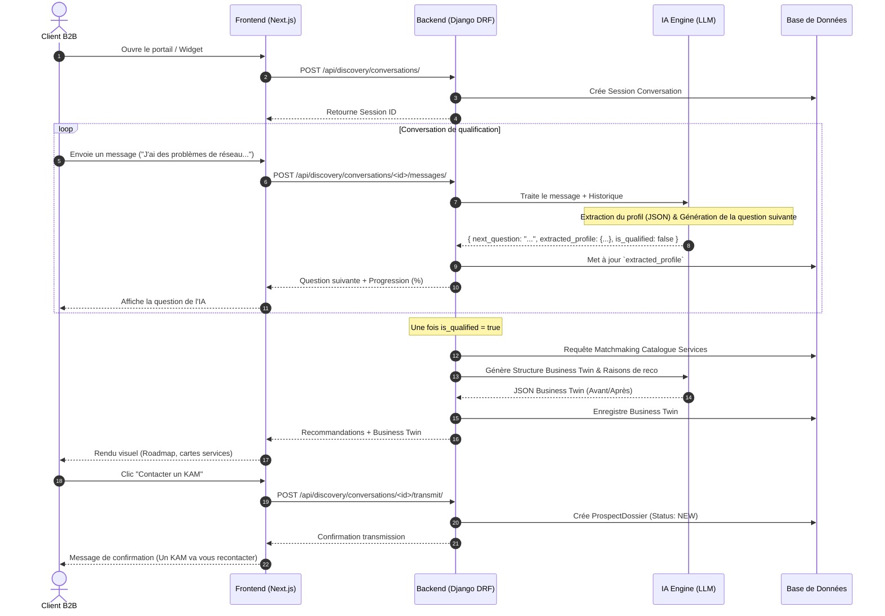

# Workflow Client B2B — Onbora

Ce document décrit le parcours fonctionnel et technique du **Client B2B** depuis son premier contact sur le portail MSP (ou Maxit/Widget) jusqu'à la transmission de son dossier qualifié au Key Account Manager (KAM).

---

## 1. Description du Parcours

1.  **Accès & Initialisation** : Le client ouvre l'interface Onbora. Il saisit un message ou clique sur "Démarrer".
2.  **Conversation Interactive (Qualification)** : Un dialogue s'engage. L'IA pose des questions ciblées pour identifier le secteur, les problèmes, les outils actuels, la taille et la localisation de l'entreprise.
3.  **Extraction en Arrière-Plan** : À chaque message, le backend extrait et met à jour un profil de besoin au format JSON (`extracted_profile`), enregistré en base de données.
4.  **Recommandation & Business Twin** : Une fois la qualification suffisante, le backend interroge le catalogue de services MSP, formule une recommandation et génère un Business Twin (comparatif avant/après).
5.  **Présentation Visuelle** : Le frontend affiche les cartes de services interactives et la visualisation du Business Twin sous forme de roadmap.
6.  **Demande de KAM** : Le client choisit de contacter un conseiller. Son dossier est verrouillé, son statut passe à `NEW` et il est transféré dans la file d'attente du KAM avec notifications.

---

## 2. Diagramme de Séquence Technique (Mermaid)



---

## 3. Schéma pour Eraser.io

```text
// Workflow Client B2B - Paste this into eraser.io

Client [icon: user, color: blue, label: "Client B2B"]
Portal [icon: browser, color: blue, label: "Portail Client (Next.js)"]
DiscoveryAPI [icon: api, color: green, label: "Discovery API (DRF)"]
LLM_Service [icon: cpu, color: purple, label: "LLM (AI Discovery Engine)"]
Database [icon: database, color: steel, label: "PostgreSQL Database"]
KAM_Queue [icon: mail, color: orange, label: "KAM Workspace Queue"]

// Connections
Client -> Portal: "1. Ouvre le widget / Initie le chat"
Portal -> DiscoveryAPI: "2. POST /api/discovery/conversations/"
DiscoveryAPI -> Database: "3. Crée la session en BDD"

loop "Dialogue de Qualification" {
  Client -> Portal: "4. Envoie une réponse"
  Portal -> DiscoveryAPI: "5. POST /api/discovery/conversations/:id/messages/"
  DiscoveryAPI -> LLM_Service: "6. Analyse du besoin + Extrait profil"
  LLM_Service -> DiscoveryAPI: "7. Retourne la question suivante + JSON Profil"
  DiscoveryAPI -> Database: "8. Met à jour extracted_profile"
  DiscoveryAPI -> Portal: "9. Retourne le message IA"
}

DiscoveryAPI -> Database: "10. Matchmaking avec le catalogue"
DiscoveryAPI -> LLM_Service: "11. Génération du Business Twin (Avant/Après)"
DiscoveryAPI -> Portal: "12. Renvoie recommandations + Twin"
Portal -> Client: "13. Rendu visuel Premium (Roadmap interactif)"

Client -> Portal: "14. Clic 'Demander un KAM'"
Portal -> DiscoveryAPI: "15. POST /api/discovery/conversations/:id/transmit/"
DiscoveryAPI -> Database: "16. Crée ProspectDossier (status: NEW)"
DiscoveryAPI -> KAM_Queue: "17. Notifie le KAM"
```
