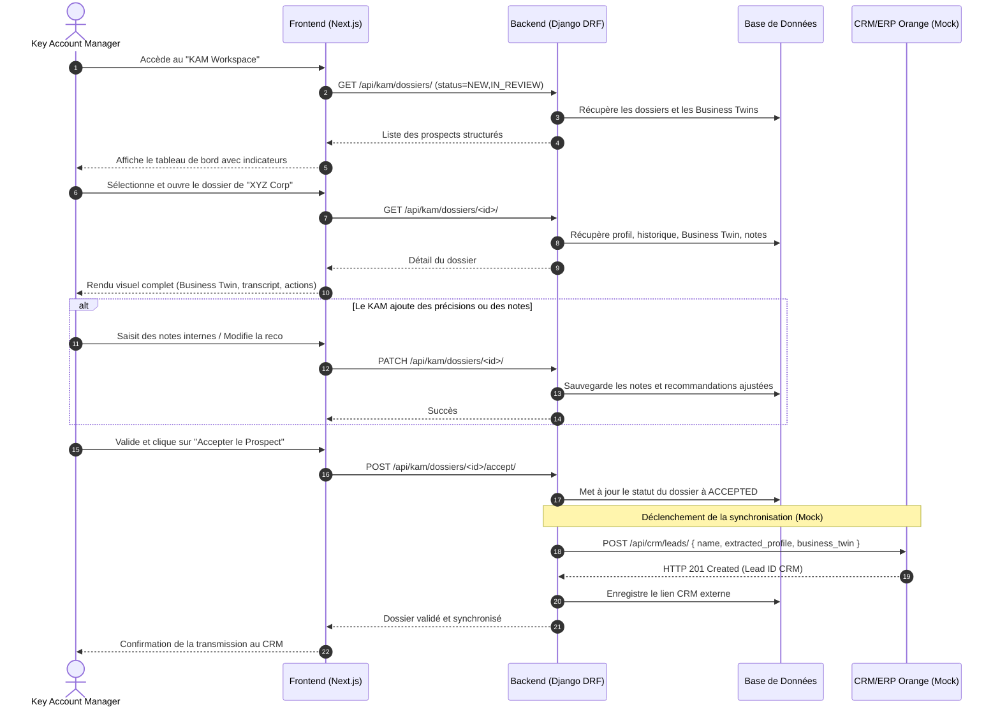

# Workflow KAM — Onbora

Ce document décrit le parcours fonctionnel et technique du **Key Account Manager (KAM)** depuis la réception d'un prospect qualifié par l'IA jusqu'à la validation du dossier et sa transmission aux outils internes du MSP.

---

## 1. Description du Parcours

1.  **Réception des Alertes** : Le KAM accède à son espace de travail (KAM Workspace) et consulte la liste des prospects qualifiés entrants, triés par date et par source (Inbound Chat ou Outbound Visite).
2.  **Analyse du Dossier Client** : Le KAM ouvre un dossier. L'interface affiche le profil complet, le résumé du besoin rédigé par l'IA, le Business Twin interactif, l'historique brut des discussions/rapports, et la liste des informations manquantes.
3.  **Ajustements & Notes Internes** : Le KAM peut ajouter ses propres notes d'analyse, modifier la liste des services recommandés et renseigner les données manquantes après un premier échange téléphonique de confirmation.
4.  **Changement de Statut** : Le KAM fait progresser le statut du dossier (`NEW` -> `IN_REVIEW` -> `ACCEPTED` ou `REJECTED`).
5.  **Synchronisation CRM & Activation** : Dès que le KAM passe le statut à `ACCEPTED`, le backend synchronise les données structurées d'Onbora avec le CRM/ERP de démonstration d'Orange Business (mock). Une fois l'activation technique simulée par l'admin, le client accède à son module de formation Onbora.

---

## 2. Diagramme de Séquence Technique (Mermaid)



---

## 3. Schéma pour Eraser.io

```text
// Workflow KAM - Paste this into eraser.io

KAM_User [icon: user, color: orange, label: "Key Account Manager"]
KAM_Dashboard [icon: monitor, color: orange, label: "KAM Workspace (Next.js)"]
KAM_API [icon: api, color: green, label: "KAM API Endpoint (DRF)"]
Database [icon: database, color: steel, label: "PostgreSQL Database"]
Orange_CRM [icon: database, color: orange, label: "Orange CRM (Mock)"]
Client_Portal [icon: browser, color: blue, label: "Client Portal (Next.js)"]

// Connections
KAM_User -> KAM_Dashboard: "1. Ouvre le workspace"
KAM_Dashboard -> KAM_API: "2. GET /api/kam/dossiers/"
KAM_API -> Database: "3. Récupère les nouveaux prospects qualifiés"
Database -> KAM_API: "4. Données brutes et Business Twin"
KAM_API -> KAM_Dashboard: "5. Affiche la liste des dossiers à traiter"

KAM_User -> KAM_Dashboard: "6. Ouvre le dossier 'XYZ Corp' et lit le diagnostic IA"
KAM_User -> KAM_Dashboard: "7. Saisit des notes de cadrage & ajuste l'offre"
KAM_Dashboard -> KAM_API: "8. PATCH /api/kam/dossiers/:id/"
KAM_API -> Database: "9. Met à jour les notes et le Business Twin"

KAM_User -> KAM_Dashboard: "10. Clique sur 'Accepter et valider'"
KAM_Dashboard -> KAM_API: "11. POST /api/kam/dossiers/:id/accept/"
KAM_API -> Database: "12. Enregistre le statut ACCEPTED"

group "Intégration Externe" {
  KAM_API -> Orange_CRM: "13. POST /api/crm/leads/ (Synchro lead)"
  Orange_CRM -> KAM_API: "14. Retourne Lead_ID CRM"
  KAM_API -> Database: "15. Enregistre le lien CRM"
}

KAM_API -> KAM_Dashboard: "16. Confirmation de succès"
Database -> Client_Portal: "17. Débloque le module d'Adoption & Formation pour le Client"
```
