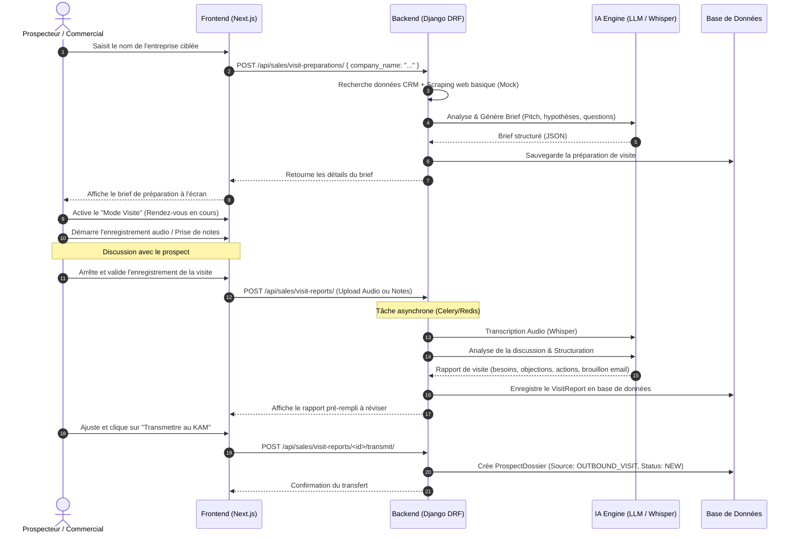

# Workflow Prospecteur — Onbora

Ce document décrit le parcours fonctionnel et technique du **Prospecteur / Commercial terrain** depuis la recherche d'une entreprise cible jusqu'à la transmission du compte rendu qualifié après sa visite au KAM.

---

## 1. Description du Parcours

1.  **Recherche & Ciblage** : Le commercial saisit le nom ou l'URL de l'entreprise cible dans son interface.
2.  **Génération du Brief Avant-Visite** : Le backend récupère les données connues (CRM, site web public) et sollicite l'IA pour générer un brief commercial (hypothèses de besoins, pitch sur-mesure, objections prévisibles, questions clés).
3.  **Mode Visite (Assistance en direct)** : Lors du rendez-vous, le commercial active le mode visite pour enregistrer la discussion (audio) ou saisir des notes au clavier/micro.
4.  **Transcription & Analyse Post-Visite** : L'audio ou les notes brutes sont transmis au backend. L'IA transcrit l'audio (Whisper) et extrait les besoins validés, les objections rencontrées, les actions à mener et rédige un projet d'email de suivi.
5.  **Validation & Transmission** : Le commercial relit, ajuste le rapport généré par l'IA et clique sur "Transmettre au KAM". Un dossier prospect structuré est créé et envoyé dans l'espace de travail du KAM.

---

## 2. Diagramme de Séquence Technique (Mermaid)



---

## 3. Schéma pour Eraser.io

```text
// Workflow Prospecteur - Paste this into eraser.io

Salesperson [icon: user, color: emerald, label: "Prospecteur Terrain"]
SalesApp [icon: tablet, color: emerald, label: "Interface Mobile/Tablette (Next.js)"]
SalesAPI [icon: api, color: green, label: "Sales API (DRF)"]
LLM_Whisper [icon: cpu, color: purple, label: "AI Core (Whisper & LLM)"]
Database [icon: database, color: steel, label: "PostgreSQL Database"]
KAM_Workspace [icon: mail, color: orange, label: "KAM Workspace Queue"]

// Connections
Salesperson -> SalesApp: "1. Recherche entreprise 'XYZ'"
SalesApp -> SalesAPI: "2. POST /api/sales/visit-preparations/"
SalesAPI -> LLM_Whisper: "3. Demande génération de brief avant-visite"
LLM_Whisper -> SalesAPI: "4. Retourne le brief (pitch, questions clés)"
SalesAPI -> Database: "5. Enregistre la préparation"
SalesAPI -> SalesApp: "6. Affiche la fiche de préparation"

Salesperson -> SalesApp: "7. Démarre l'enregistrement audio pendant le RDV"
Salesperson -> SalesApp: "8. Clôture le RDV et envoie l'audio"
SalesApp -> SalesAPI: "9. POST /api/sales/visit-reports/ (Upload .mp3)"

SalesAPI -> LLM_Whisper: "10. Transcrit l'audio (Whisper) + Extrait insights"
LLM_Whisper -> SalesAPI: "11. Renvoie le rapport structuré + Brouillon mail"
SalesAPI -> Database: "12. Enregistre le rapport de visite"
SalesAPI -> SalesApp: "13. Propose le rapport généré pour révision"

Salesperson -> SalesApp: "14. Modifie et clique sur 'Transmettre'"
SalesApp -> SalesAPI: "15. POST /api/sales/visit-reports/:id/transmit/"
SalesAPI -> Database: "16. Crée ProspectDossier (status: NEW)"
SalesAPI -> KAM_Workspace: "17. Notifie le KAM assigné"
```
